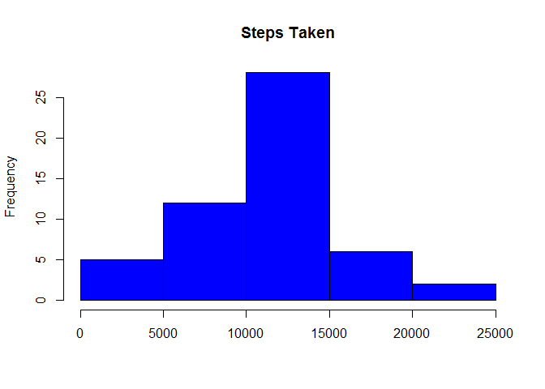
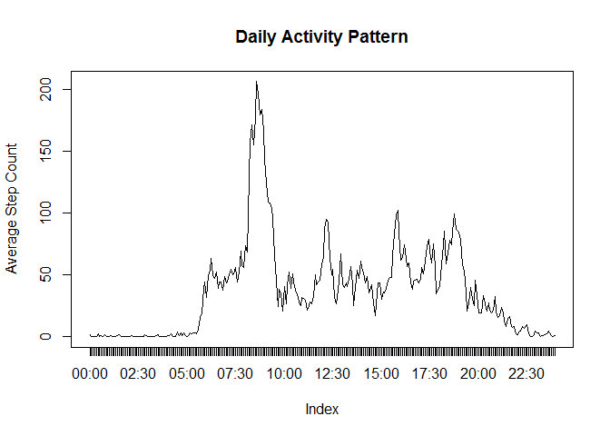
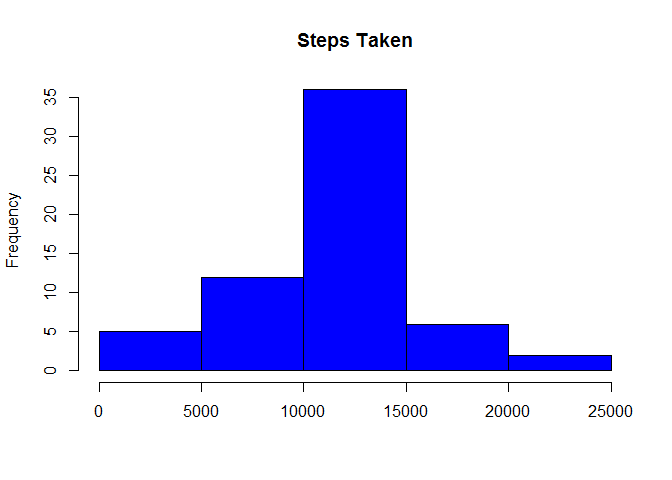
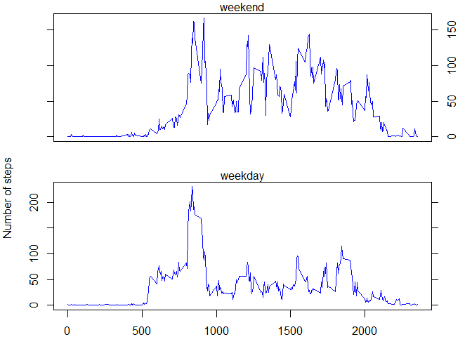

# Reproducible Research: Peer Assessment 1

## Loading and preprocessing the data


```r
  setwd("~/RepData_PeerAssessment1")
  unzip("activity.zip")
  df_activity<-read.csv("activity.csv")
  #
  # add hour of observation for subsequent analysis
  df_activity$hour<-paste(sprintf("%02d", df_activity$interval / 100), 
                          sprintf("%02d", df_activity$interval %% 100), sep=":")
  # calcuate totals by day
  df_steptotal<-tapply(df_activity$steps, df_activity$date, FUN=sum)
  
  df_steptotal<-data.frame(steps=df_steptotal, date=row.names(df_steptotal))
  
  #calculate average by hour
  df_hourtotal<-tapply(df_activity$steps, df_activity$hour, FUN=mean, na.rm=TRUE)
  
  df_hourtotal<-data.frame(steps=df_hourtotal, hour=row.names(df_hourtotal))
```

## What is mean total number of steps taken per day?

```r
  hist(df_steptotal$steps, main="Steps Taken", xlab="", 
     col = "blue")
```

 
 
###Mean is 

```r
  mean(df_steptotal$steps, na.rm = TRUE)
```

```
## [1] 10766.19
```
###Median is

```r
  median(df_steptotal$steps, na.rm = TRUE)
```

```
## [1] 10765
```
## What is the average daily activity pattern?

```r
  df_hourtotal<-tapply(df_activity$steps, df_activity$hour, FUN=mean, na.rm=TRUE)
  df_hourtotal<-data.frame(steps=df_hourtotal, hour=as.factor(row.names(df_hourtotal)))
  plot(df_hourtotal$steps, type="l", xaxt = "n", ylab = "Average Step Count",
       main = "Daily Activity Pattern")
  axis(1, labels = df_hourtotal$hour, at=c(1:length(df_hourtotal[[1]])))
```

 

###  
### The time interval with the highest average number of steps

```r
  row.names(df_hourtotal[df_hourtotal$steps == max(df_hourtotal$steps),])
```

```
## [1] "08:35"
```

## Imputing missing values
###  NA values in steps for any period are replaced by the average number of 
###  steps in the same interval

```r
  library(sqldf)
```

```
## Warning: package 'sqldf' was built under R version 3.2.2
```

```
## Loading required package: gsubfn
```

```
## Warning: package 'gsubfn' was built under R version 3.2.2
```

```
## Loading required package: proto
```

```
## Warning: package 'proto' was built under R version 3.2.2
```

```
## Loading required package: RSQLite
```

```
## Warning: package 'RSQLite' was built under R version 3.2.2
```

```
## Loading required package: DBI
```

```
## Warning: package 'DBI' was built under R version 3.2.2
```

```r
  df_activity2<-sqldf("SELECT df_activity.steps, date, interval, hour, df_hourtotal.steps AvgSteps
          FROM df_activity JOIN df_hourtotal USING(hour)")
```

```
## Loading required package: tcltk
```

```r
  df_activity2$steps[is.na(df_activity2$steps)]<-
    df_activity2$AvgSteps[is.na(df_activity2$steps)]
  df_activity2$AvgSteps<-NULL
 # calcuate totals by day for the new data frame with imputed values
  df_steptotal2<-tapply(df_activity2$steps, df_activity2$date, FUN=sum)
  
  df_steptotal2<-data.frame(steps=df_steptotal2, date=row.names(df_steptotal2))
```
## What is mean total number of steps taken per day when NA is replaced by mean?

```r
  hist(df_steptotal2$steps, main="Steps Taken", xlab="", 
     col = "blue")
```

 

###Mean for the imputed data is 

```r
  mean(df_steptotal2$steps, na.rm = TRUE)
```

```
## [1] 10766.19
```
###Median for the imputed data is

```r
  median(df_steptotal2$steps, na.rm = TRUE)
```

```
## [1] 10766.19
```
The replacement of NA with mean values has shifted the median to equal the mean,
which has not changed.  The center of the histogram reflects the additional steps added due to the mean replacement.

## Are there differences in activity patterns between weekdays and weekends?

```r
  # determine if the date is a weekend or weekday
  df_activity2$weekend<-ifelse(as.character(weekdays(as.Date(df_activity2$date), 
                                                     abbreviate = TRUE))=="Sat" |
                                 as.character(weekdays(as.Date(df_activity2$date),
                                                       abbreviate = TRUE))=="Sun",
                               "weekend", "weekday")
  # Summarize by weekend
  df_weekendsummary<-aggregate(steps~interval+weekend, data = df_activity2, mean)
  par(mfrow = c(2, 1), mar=c(2,4,1,3))
  plot(df_weekendsummary$interval[df_weekendsummary$weekend == "weekend"],
       df_weekendsummary$steps[df_weekendsummary$weekend=="weekend"], 
       type = "l", xaxt="n", yaxt="n", ylab="", xlab="",col="blue")
  axis(2, labels = FALSE)
  axis(4)
  mtext("weekend", side=3)
  #par(mar=c(2,4,1,0))
  plot(df_weekendsummary$interval[df_weekendsummary$weekend == "weekday"],
       df_weekendsummary$steps[df_weekendsummary$weekend=="weekday"], 
       type = "l", ylab="", xlab="Interval",col="blue")
  axis(4, labels = FALSE)
  mtext("Number of steps", side = 2, line = 3, adj=1.5)
  mtext("weekday", side=3)
```

 

#### Weekend activity is, on average, higher during the day ("business hours").

